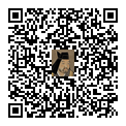

# Lineで通知 高過ぎ謙信

## 謙信はここにおる



https://line.me/R/oaMessage/%40995vlnlq/?VUNSMmFFYzJNbDk0VnlSK2FTTkZkelpXWkVSYVpIdzNaQzRxTDAxRA


## 説明

健診結果の高過ぎる項目について上杉謙信公より指摘・アドバイスをいただけるという画期的アプリです。

本アプリはデモバージョンのため、サンプルの健診結果についてのみ実行できます。


## ローカル実行方法

1. 事前準備
    * Line Messaging APIチャネルの作成
    https://developers.line.biz/ja/docs/messaging-api/getting-started/
        * Line Developers Console → Messaging API設定でチャネルアクセストークンを発行する
        * Line Official Account Manager → アカウント設定 → アカウント情報でベーシックIDを確認する
    * ngrokのインストール
    https://ngrok.com

1. プロジェクトの準備

    ```shell
    $ git clone git@github.com:kt-52/takasugi-kenshin.git
    $ cd takasugi-kenshin
    $ npm install
    $ cp environment.json.example environment.json
    ```

    `environment.json` の `channelAccessToken` の値を手順1で発行したチャネルアクセストークンに変更

1. プロジェクトの起動

    手順2のターミナルで引き続き以下のコマンドを実行

    ```shell
    $ npm start
    ```

1. ngrokの起動

    手順3とは別のターミナルで以下のコマンドを実行

    ```shell
    ngrok http 8080
    ```

    表示されるForwardingのURLを確認する

    ```shell
    Forwarding 【確認すべきURL】 -> http://localhost:8080
    ```

1. webhookの設定
    * Line Developers Console → Messaging API設定で「Webhookの利用」にチェックを入れ、「Webhook URL」に手順4で確認したForwardingのURLの後ろに `webhook` をつけたものを入力する
        * 例）`https://hoge-hoge.ngrok-free.app/webhook`

1. 実行

    以下のURLをQRコード化し、Lineのインストールされているスマートフォンで読み取る

    ```
    https://line.me/R/oaMessage/【手順1で確認したベーシックIDをurl encodeしたもの】/?VUNSMmFFYzJNbDk0VnlSK2FTTkZkelpXWkVSYVpIdzNaQzRxTDAxRA
    ```
