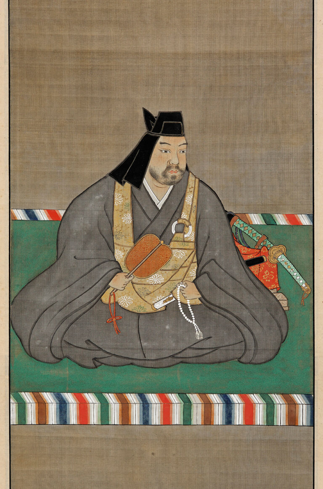

<!-- paginate: true -->

# もいせんハッカソン Team B

## メンバー

- k_taira
- enumura

<!--
もいせんハッカソン Team Bの発表は、
平良「k_tairaと」
中村「enumuraがお送りします！」
-->

---

<!--
ここから 時間の都合上カット
-->


# 自己紹介

- k_taira（平良 一真）
- 注射が怖い
- 高脂血症で健診引っかかってます

---

# 自己紹介

- enumura
- フロントの開発が好きなエンジニアです。
- 自作キーボードや3Dモデル制作などのものづくりをやってます。
- 昔から注射は苦手です。。

---

### それでは発表に移ります。

<!--
ここまで 時間の都合上カット
-->

---

# Lineで通知 健診結果

- powered by 健診システムズ

---

# と、見せかけて・・・

---



## ~~Lineで通知 健診結果~~

~~powered by 健診システムズ~~

# Lineで通知 高過ぎ謙信

- powered by 謙信システムズ

<!--
これは、健診結果で高過ぎる項目を上杉謙信が指摘・アドバイスをしてくれるという画期的なwebアプリとなっています。
では、なぜ上杉謙信なのかをご説明しましょう。
-->

---


<!--
時は戦国、上杉謙信と武田信玄は川中島で戦を繰り広げていた。
上杉謙信の領地は現在の新潟県であり、日本海の塩を陸地に売っていた。
他方、武田信玄の領地は現在の山梨県・長野県であり、海がないため塩は貿易に頼っていた。
上杉謙信は武田信玄との戦いの最中も塩の貿易を続け、敵国の民を苦しめることはしなかった。
これが「敵に塩を送る」のことわざの由来である。

そう、上杉謙信は敵国の民の健康をも守ったのである。
-->

---


### ※画面は開発中のものです

<!--
そして現代、上杉謙信は我々の健康を守るべくLineを通じて蘇った！
-->

---


---


# 実演

### デモに使用するQRコード→

---


# ご清聴ありがとうございました

```
              わしからも感謝いたす >
```

<!--
以上です、ご清聴ありがとうございました。
-->
