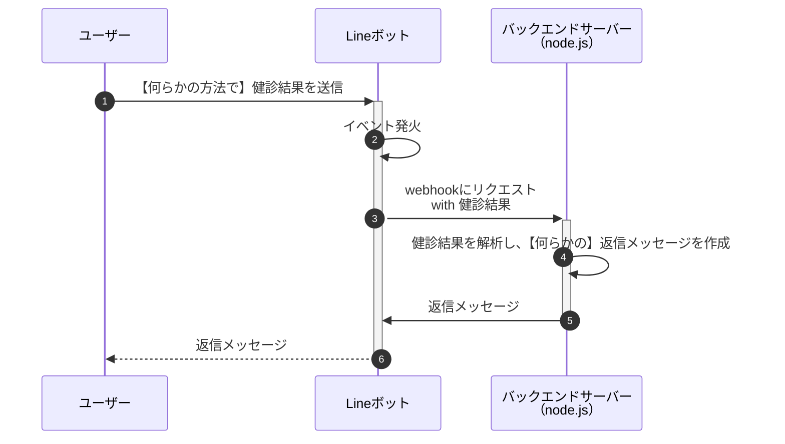

# シーケンス図

```mermaid
sequenceDiagram
  autoNumber
  participant user as ユーザー
  participant line as Lineボット
  participant server as バックエンドサーバー<br>（node.js）

  user ->>+ line: 【何らかの方法で】健診結果を送信
    line ->> line: イベント発火
    line ->>+ server: webhookにリクエスト<br>with 健診結果
      server ->> server: 健診結果を解析し、【何らかの】返信メッセージを作成
    server ->>- line: 返信メッセージ
  line -->>- user: 返信メッセージ
```
