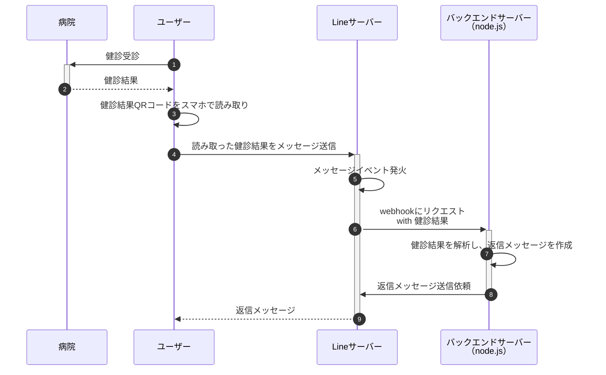

# シーケンス図

```mermaid
sequenceDiagram
  autoNumber
  participant clinic as 病院
  participant user as ユーザー
  participant line as Lineサーバー
  participant server as バックエンドサーバー<br>（node.js）

  user ->>+ clinic: 健診受診
  clinic -->>- user: 健診結果
  user ->> user: 健診結果QRコードをスマホで読み取り
  user ->>+ line: 読み取った健診結果をメッセージ送信
    line ->> line: メッセージイベント発火
    line ->>+ server: webhookにリクエスト<br>with 健診結果
      server ->> server: 健診結果を解析し、返信メッセージを作成
    server ->>- line: 返信メッセージ送信依頼
  line -->>- user: 返信メッセージ
```
